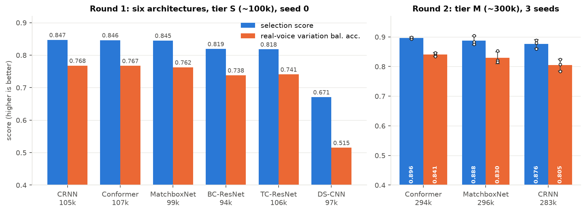
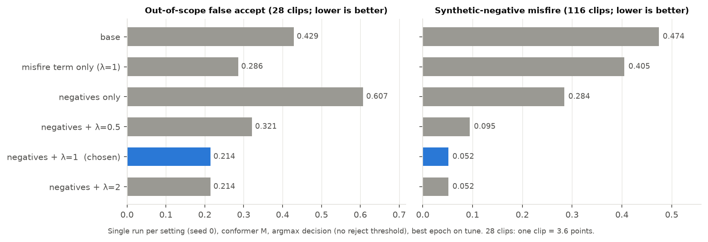
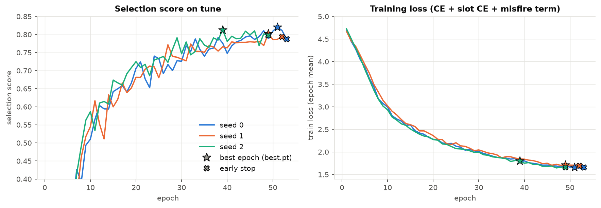
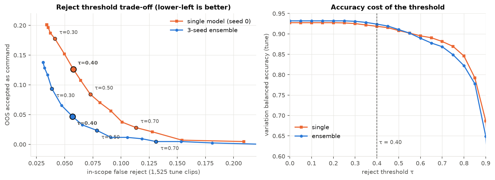
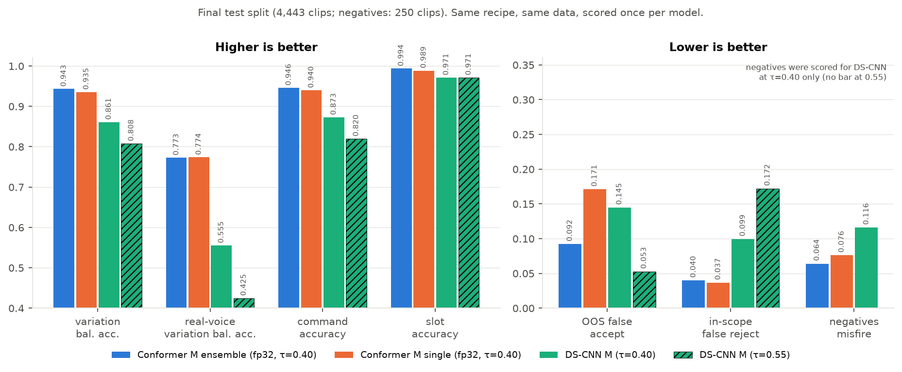

# A Tiny On-Device Voice Command Model Trained From Scratch

**vcm-me2, release v1.0** · AI231 ME2 · author: airimonda · repository: <https://github.com/airimonda/vcm-me2>

---

## Abstract

We describe a small voice command model that maps one 5-second window of 16 kHz audio to one of 19 smart-device commands or an `OUT_OF_SCOPE` class, and, for six commands, to one of three slot values (for example a timer length or a colour). The model is trained from random initialisation on a speaker-disjoint dataset of 10,733 training clips, about 78% of them synthetic speech. It contains no pretrained weights, no speech recogniser, no language model and no network call. The log-mel front end is part of the exported ONNX graph, so inference needs only `onnxruntime` and `numpy`.

Six small architectures were compared at about 100k and about 300k parameters under one shared recipe. A four-layer conformer-style network (294,246 parameters) was the best on mean selection score and had the smallest spread across three seeds. The released model is an ensemble of three such networks that share one front end (882,738 parameters; 4.46 MB as fp32 ONNX, 2.78 MB as int8). On a speaker-disjoint test split of 4,443 clips the ensemble reaches a variation balanced accuracy of 0.9431 (93 phrase variations plus the out-of-scope group) with a reject threshold of 0.40. The same recipe with a depthwise-separable CNN of similar size reaches 0.8610. The weak points are measured and reported: accuracy on real (non-synthetic) voices is 0.7727 on the same metric, 7 of 76 out-of-scope test clips (9.2%) are accepted as commands, and 20% of synthetic babble clips and 10% of truncated-command clips are accepted. On a Raspberry Pi 4 the ensemble runs one 5-s window in 89 ms on one core (real-time factor 0.018); int8 gives no speed-up there, so fp32 is deployed.

---

## 1 Introduction

**Task.** The AI231 ME2 brief asks for a tiny on-device voice command model with these properties:

* a closed set of the most common smart-device commands (play, pause, lights, timers, alarms, temperature and so on);
* no automatic speech recognition (ASR), no large language model and no cloud service at inference time;
* real-time operation on a Raspberry Pi 4 or 5;
* speaker independence;
* training from scratch, with no pretrained weights and no pretrained feature extractors.

We treat this as a classification problem rather than a transcription problem. Given a fixed 5-second window the model outputs a command class and, where the command takes a parameter, a choice among three allowed values. Anything that is not one of the 19 commands should be mapped to `OUT_OF_SCOPE`.

**Approach in brief.** One shared recipe (front end, heads, data, augmentation, loss, stopping rule) was held fixed while the backbone was varied. This follows the keyword-spotting literature, where depthwise-separable CNNs (Zhang et al., 2017), temporal-convolution ResNets (Choi et al., 2019), broadcast-residual networks (Kim et al., 2021), 1D time-channel separable networks (Majumdar and Ginsburg, 2020) and attention models (Berg et al., 2021) are standard small-footprint choices. Our best backbone is a small conformer-style network (after Gulati et al., 2020). A separate part of the work deals with the failure mode that matters most for a device that listens continuously: non-command audio that is accepted as a command (a *misfire*). We address it with synthetic negatives and a loss term in the spirit of outlier exposure (Hendrycks et al., 2019), together with a reject threshold on the top softmax probability.

**Contributions.**

1. A single-file ONNX model, front end included, for a 20-way command decision plus six 3-way slot decisions (Sections 4 and 8).
2. A controlled comparison of six architectures at two sizes, with three seeds in the second round (Section 7a, 7b).
3. Ablations of the misfire regularisation, its weight and the augmentation preset, all selected on a speaker-disjoint *tune* split rather than on the test split (Section 7c).
4. A strict account of which split was used for which decision, including two places where the test split was looked at more than the ideal protocol allows (Section 6).

**What this paper does not claim.** Pi results come from a Raspberry Pi 4 only (no Pi 5). The model-only latency in Section 8 uses a synthetic input; the live holdout test (Section 8.x) runs the full pipeline but feeds the audio straight into the runtime with added air-conditioner noise rather than through a loudspeaker and room, and its wake-word results rest on one speaker's "Watson" takes. Real-voice accuracy is substantially lower than accuracy on synthetic voices (Section 9).

---

## 2 Task and label space

The label space is defined in `vcm/labels.py` and `configs/variations.csv`.

* **20 command classes**: 19 commands plus `OUT_OF_SCOPE` (index 19).
* **6 slotted commands**: `TIMER`, `ALARM`, `TEMPERATURE`, `BRIGHTNESS`, `COLOR`, `CREATE_REMINDER`. Each has exactly 3 allowed slot values, giving 6 slot heads of 3 outputs.
* **93 phrase variations** (called "Option B" in the brief). The 13 non-slotted commands have 3 phrasings each (39). The 6 slotted commands have 3 phrasings × 3 slot values each (54). 39 + 54 = 93.
* **94 evaluation groups**: the 93 variations plus the out-of-scope group.

The model does not predict the variation itself, only `(command, slot)`. A clip counts as correct when the command is correct and, for slotted commands, the slot value is also correct. A slotted-command clip whose slot value is not one of the three allowed values has no variation label; its slot loss is masked in training and it is excluded from the variation metrics (`row_to_labels` in `vcm/labels.py`).

**Table 1.** The label space. Phrases are taken from `configs/variations.csv`.

| Idx | Command | Slotted | Slot values (3 each) | Phrase variations (‹v› = slot value) | Variations |
| ---: | --- | --- | --- | --- | ---: |
| 0 | PLAY_MUSIC | no | — | "Play music"; "Start music"; "Play some music" | 3 |
| 1 | PAUSE | no | — | "Pause"; "Pause audio"; "Pause song" | 3 |
| 2 | STOP | no | — | "Stop"; "Stop playing"; "End playback" | 3 |
| 3 | NEXT | no | — | "Next song"; "Skip song"; "Play next song" | 3 |
| 4 | VOLUME_UP | no | — | "Volume up"; "Increase the volume"; "Turn the volume up" | 3 |
| 5 | VOLUME_DOWN | no | — | "Volume down"; "Lower the volume"; "Turn the volume down" | 3 |
| 6 | LIGHT_ON | no | — | "Lights on"; "Power on the lights"; "Turn on the lights" | 3 |
| 7 | LIGHT_OFF | no | — | "Lights out"; "Kill the lights"; "Shut off the lights" | 3 |
| 8 | WEATHER | no | — | "Weather"; "What's the weather?"; "Tell me the weather" | 3 |
| 9 | TIME | no | — | "Time"; "What time is it?"; "Tell me the time" | 3 |
| 10 | CALL | no | — | "Call"; "Make a call"; "Make a phone call" | 3 |
| 11 | MESSAGE | no | — | "Message"; "Send a message"; "Send my message" | 3 |
| 12 | LIST_REMINDERS | no | — | "Reminders"; "Show my reminders"; "List my reminders" | 3 |
| 13 | TIMER | yes | 10 seconds, 30 seconds, 1 minute | "Timer ‹v›"; "Countdown for ‹v›"; "Start a timer for ‹v›" | 9 |
| 14 | ALARM | yes | 6:00 AM, 8:00 AM, 9:00 PM | "Alarm ‹v›"; "Wake me up at ‹v›"; "Set an alarm for ‹v›" | 9 |
| 15 | TEMPERATURE | yes | 18 degrees, 22 degrees, 26 degrees | "Temperature ‹v›"; "Change the temperature to ‹v›"; "Set the temperature to ‹v›" | 9 |
| 16 | BRIGHTNESS | yes | 20 percent, 60 percent, 100 percent | "Brightness ‹v›"; "Adjust brightness to ‹v›"; "Brightness level ‹v›" | 9 |
| 17 | COLOR | yes | Red, Blue, Green | "Change color to ‹v›"; "Switch color to ‹v›"; "Set color to ‹v›" | 9 |
| 18 | CREATE_REMINDER | yes | Drink water, Study, Exercise | "Reminder ‹v›"; "Remind me to ‹v›"; "Create a reminder to ‹v›" | 9 |
| 19 | OUT_OF_SCOPE | no | — | anything else: other speech, noise, partial speech (no phrase list) | — (1 group) |

---

## 3 Dataset

The data are released on the Hugging Face Hub as `airimonda/ai231-me2-voice-commands`. The default configuration has three speaker-disjoint splits. A second configuration, `synthetic_negatives`, holds generated non-command clips. Counts below are those recorded by the project for the release; where the training logs in `results/runs/*/train.log` also contain a count, it agrees (train 10,733 and test 4,443 in the bake-off logs).

**Real and synthetic speech.** Real voices were recorded by the project group and collected from open corpora (the sources named in the code and manifests are Common Voice, SLURP, Fluent Speech Commands, SNIPS, Speech Commands v2 and TimersAndSuch). Synthetic voices were generated by the group. The shares per split are:

| Split | Clips | Real | Synthetic | Out-of-scope |
| --- | ---: | ---: | ---: | ---: |
| train | 10,733 | 2,359 | 8,374 | 270 |
| test | 4,443 | 824 | 3,619 | 76 |
| holdout | 202 | 96 | 106 | 16 |

The synthetic count for test (3,619) is confirmed by `results/final/*/metrics.json` (the `by_is_synthetic` breakdown). The synthetic counts for train and holdout are the differences between the totals and the real counts.

**Synthetic negatives (`synthetic_negatives` configuration).** 1,000 train and 250 test clips, all labelled `OUT_OF_SCOPE`, generated by `scripts/make_negatives.py` in five equal kinds (50 per kind in the test set):

| Kind | Construction |
| --- | --- |
| `noise_only` | a noise segment at random level |
| `babble` | 3 to 6 clips of the split summed at random offsets |
| `reversed` | one clip played backwards |
| `truncated` | the first 25 to 40% of the speech of an in-scope clip, so a full command is never present |
| `near_silence` | very low noise or digital near-silence with mic hiss |

Train negatives are built only from train clips and test negatives only from test clips, so speakers stay disjoint. Noise files are split by filename hash, 80% train and 20% test. The generator is deterministic for a given seed.

**The tune split.** `scripts/make_tune_split.py` carves a speaker-disjoint slice of about 15% out of *train* (`--frac 0.15 --seed 0`). Whole speakers are moved, stratified by source and accent group, and topped up so that every variation and the out-of-scope group has at least 3 tune clips. The result is 1,553 tune clips, of which 28 are out-of-scope, and 9,180 clips that remain for fitting (10,733 − 1,553). Synthetic negatives follow their sources: a negative goes to the tune side only if all of its train source clips belong to tune speakers, and rows with sources on both sides are dropped. The training log of the final recipe reports 778 training negatives and 116 tune negatives (`neg_tune`), so 106 of the 1,000 negatives were in neither set (1,000 − 778 − 116 = 106; derived here, consistent with the dropping rule).

**The `tune_oos` set.** Only 28 gold out-of-scope clips fall into the tune split, too few to set a reject threshold. `scripts/make_tune_oos.py` therefore builds an *evaluation-only* set of 400 out-of-scope clips from speakers that appear in none of train, test or holdout: near-miss requests from SLURP, Fluent Speech Commands, SNIPS and TimersAndSuch (50%), and general speech from Common Voice (the rest). It is never trained on. See Section 9 for what it does not cover.

**Table 2.** All splits and their role.

| Split | Clips | Role |
| --- | ---: | --- |
| train, fitting part | 9,180 (+ 778 synthetic negatives) | Fits the weights. |
| tune | 1,553 (+ 116 synthetic negatives, `neg_tune`) | Speaker-disjoint slice of train. Makes every choice after bake-off round 2: checkpoint, early stopping, ablations, misfire weight, reject threshold, ensembling. |
| tune_oos | 400 out-of-scope clips | Evaluation only. Together with the 28 gold tune out-of-scope clips it sets the reject threshold. |
| test | 4,443 (+ 250 synthetic negatives, `neg_test`) | Used to select among architectures in bake-off rounds 1 and 2 (per-epoch scoring), and for the final report. Guarded by `--final-test` in `vcm/eval.py`. |
| holdout | 202 | Reserved for the live test on the Raspberry Pi. No result in `results/` uses it. |

Bake-off rounds 1 and 2 (Section 7a, 7b) were run before the tune split existed and trained on all 10,733 train clips; their logs show `train 10733 test 4443`.

**Preprocessing (`scripts/pack_data.py`).** Each clip gets an energy-based speech trim. Test and holdout clips are placed with the speech centred in exactly 5.0 s (80,000 samples), keeping the loudest 5 s if the trimmed speech is longer. Train clips keep up to 6 s of speech centred in a 96,000-sample buffer, from which training takes a random 5-s crop. Tune clips use the centred 5-s window of that buffer.

---

## 4 Model

### 4.1 Pipeline

```
 waveform (B, 80000)  float32, 16 kHz, range [-1, 1]
    |
    v
 FRONT END  (inside the ONNX graph, no trainable parameters)
    STFT as fixed conv1d: n_fft 400, hop 160, Hann window
    power -> 64 mel bands -> log(. + 1e-6)
    per-utterance mean/std normalisation
    |   log-mel (B, 64, 498)
    v
 BACKBONE: conformer, tier M
    Conv1d(64 -> 64, kernel 8, stride 4) + BatchNorm + ReLU   -> (B, 64, 124)
    4 x ConformerBlock (d_model 64, 4 heads, FF x2, conv kernel 9)
    |   (B, 64, 124)
    v
 ATTENTION POOLING (learned query)  -> (B, 64)
    |
    v
 HEADS (dropout 0.1)
    command head: Linear(64 -> 20)
    slot heads:   Linear(64 -> 18) reshaped to 6 x 3
    |
    v
 DECISION
    p = softmax(command logits)
    if max(p) < tau:  OUT_OF_SCOPE
    else:             command = argmax(p);
                      slot = argmax of that command's slot head (slotted commands only)

 ENSEMBLE (released model): 3 x (backbone + pooling + heads) share ONE front end;
 outputs = log(mean of the 3 softmax distributions), for command and slot heads.
```

### 4.2 Front end

The front end (`vcm/features.py`) is the same module in training and inside the exported graph.

* The STFT is a strided `conv1d` with fixed DFT weights and a periodic Hann window folded in, so it exports to ONNX as ordinary convolutions. `n_fft` = 400 (25 ms), `hop` = 160 (10 ms), no centre padding, so a 5-s window (80,000 samples) gives (80,000 − 400) // 160 + 1 = 498 frames.
* Power spectrum, then 64 triangular mel filters (HTK-style, 20 Hz to 8 kHz, area-normalised), then `log(mel + 1e-6)`.
* Per-utterance instance normalisation: mean and standard deviation over the whole 64 × 498 map. This makes the network insensitive to overall gain.

The input window is fixed at 5 s. Shorter audio must be padded and longer audio cut by the caller.

### 4.3 Backbone: conformer at tier M

`TinyConformer` in `vcm/models.py`, configuration `TIER_CONFIGS["conformer"]["M"]`:

| Hyperparameter | Value |
| --- | --- |
| model width `d_model` | 64 |
| layers | 4 |
| attention heads | 4 (head size 16) |
| feed-forward multiplier `ff_mult` | 2 (hidden size 128) |
| depthwise conv kernel in each block | 9 |
| subsampling | one `Conv1d(64, 64, kernel 8, stride 4, padding 2)` + BatchNorm + ReLU: 498 frames → 124 tokens (40 ms per token) |
| pooling | attention pooling with a learned query (below) |

Each block follows the conformer layout: a half-step feed-forward module (LayerNorm, Linear, SiLU, Linear; residual weight 0.5), multi-head self-attention with pre-LayerNorm, a convolution module (LayerNorm, pointwise conv to 2d with GLU, depthwise conv, BatchNorm, SiLU, pointwise conv), a second half-step feed-forward module, and a final LayerNorm. There is no explicit positional encoding; position information comes from the strided convolution and the depthwise convolutions. Tier S of the same architecture (d 56, 2 layers, ff_mult 1) has 106,830 parameters and was used only in round 1.

**Attention pooling.** For tokens `x_t`, the score is `s_t = q · tanh(W x_t)` with a learned query `q` and a bias-free linear map `W`; the pooled vector is `Σ_t softmax(s)_t x_t`.

**Heads.** A shared `Heads` module applies dropout (0.1) and then two linear layers on the pooled vector: a 20-way command head and a single 18-output layer reshaped to 6 slot heads of 3. At inference the slot head used is the one that belongs to the predicted command.

**Decision rule.** Take `p = softmax(cmd_logits)`. If `max(p) < tau`, the output is `OUT_OF_SCOPE`. Otherwise the command is `argmax(p)`, and if that command is slotted, the slot is the argmax of the corresponding slot head. The released models use `tau = 0.40` (Section 7d).

**Ensemble.** `EnsembleModel` runs the front end once, passes the same log-mel map through three independently trained backbone/pool/head stacks (seeds 0, 1, 2), averages their softmax outputs for both the command and the slot heads, and returns the logarithm of the mean. Because `softmax(log p) = p`, downstream code treats the ensemble exactly like a single model.

### 4.4 Parameter counts

Counts were computed with `vcm.models.build_model("conformer", "M")` and summing `numel` over trainable parameters per submodule.

| Module | Parameters |
| --- | ---: |
| Front end (fixed DFT and mel buffers) | 0 |
| Subsampling conv + BatchNorm | 32,896 |
| Conformer blocks, 4 × 63,680 | 254,720 |
| Backbone total | 287,616 |
| Attention pooling (`W` 4,096 + query 64) | 4,160 |
| Command head (64 × 20 + 20) | 1,300 |
| Slot heads (64 × 18 + 18) | 1,170 |
| Heads total | 2,470 |
| **Single model** | **294,246** |
| **Ensemble of three** (3 × 294,246) | **882,738** |

Per block (63,680): two feed-forward modules 2 × 16,704 = 33,408; attention 16,640; convolution module 8,320 + 640 + 128 + 4,160 = 13,248; three block-level LayerNorms 3 × 128 = 384. Sum: 33,408 + 16,640 + 13,248 + 384 = 63,680.

The other five architectures at tier M have 268,866 (BC-ResNet), 282,838 (CRNN), 287,078 (TC-ResNet), 295,502 (MatchboxNet) and 308,270 (DS-CNN) parameters; at tier S, 93,750 to 106,830 (Table 4).

---

## 5 Training

### 5.1 Loss

For a batch, the loss is

```
L = CE(command logits, label; label smoothing 0.1)
  + CE(slot logits of the TRUE command's head, slot label; label smoothing 0.1)   [masked]
  + λ · mean over OUT_OF_SCOPE rows of (1 − p_OOS)
```

The slot term uses only rows whose true command is slotted and whose slot value is one of the three allowed values; other rows contribute nothing. The misfire term is the probability mass the command head puts on any command for rows whose true class is out-of-scope (computed without label smoothing); it is zero if the batch has no such row, and `λ = 0` switches it off. The final recipe uses `λ = 1.0` (`--misfire-weight 1.0`). `vcm/losses.py` implements all three terms.

### 5.2 Optimisation

| Setting | Value |
| --- | --- |
| optimiser | AdamW; weight decay 0.01 on tensors with 2 or more dimensions, 0 on biases and norm parameters |
| learning rate | 3e-3 peak |
| schedule | per-step: linear warm-up for 2 epochs, then cosine decay over a 60-epoch horizon to 1% of the peak |
| batch size | 64 |
| gradient clipping | global norm 5.0 |
| mixed precision | AMP (fp16 autocast) on CUDA for the backbone; front end and loss in fp32 |
| seeds | 0, 1, 2 (Python, NumPy, Torch; cuDNN deterministic) |
| epoch length | as many draws as there are training clips; 155 steps per epoch for the final recipe (9,958 clips with negatives, drop-last) |

**Sampling weights.** Clips are drawn with replacement with weight 5 for real voices, multiplied by 3 for out-of-scope gold clips, and 1 for synthetic speech. Synthetic negatives have weight 1 (`negatives_weight` 1.0). The weights multiply, so a real out-of-scope clip has weight 15. The sampler is seeded per epoch, so a resumed run reproduces the same draws.

### 5.3 Augmentation

Augmentation runs on the training device in `vcm/augment.py`. Each operation fires independently per sample with the probability shown.

**Table 3.** Augmentation presets. "—" means the operation is off.

| Operation | Details | `none` | `light` | `heavy` |
| --- | --- | :-: | :-: | :-: |
| speed perturbation | factor 0.85 to 1.15 (linear-interpolation resample) | — | 0.2 | 0.5 |
| random time shift | ±0.5 s, merged with the crop to 5 s | — | 0.5 | 0.8 |
| pitch shift | ±3 semitones (phase-vocoder stretch + resample) | — | — | 0.25 |
| synthetic reverb | exponentially decaying noise impulse response, RT60 0.1 to 0.8 s, direct-to-reverberant ratio −2 to 14 dB | — | 0.1 | 0.3 |
| random EQ | high-pass (50 to 400 Hz) or low-pass (3 to 7.5 kHz) or neither, plus 1 to 2 peaking bands of ±8 dB | — | 0.2 | 0.5 |
| telephone band-limit | high-pass 250 to 350 Hz and low-pass 3.2 to 3.8 kHz, 4th order each | — | — | 0.1 |
| babble | sum of 2 to 4 other clips of the batch at 10 to 25 dB SNR | — | — | 0.2 |
| additive noise | noise files (DEMAND, MS-SNSD) or white, pink, brown; SNR 5 to 30 dB (`light`), 0 to 30 dB (`heavy`) | — | 0.3 | 0.7 |
| codec-like quantisation | 6 to 12 bit depth or 8-bit mu-law | — | — | 0.1 |
| hard clipping | threshold at 20 to 70% of the peak | — | — | 0.1 |
| gain | ±10 dB | — | 0.4 | 0.8 |
| polarity flip | | — | 0.3 | 0.5 |
| SpecAugment | 2 time masks of up to 40 frames, 2 frequency masks of up to 10 bins | — | 0.5 | 0.8 |
| time warp | on the log-mel map, anchor displacement up to ±20 frames | — | — | 0.3 |

SpecAugment is due to Park et al. (2019); the noise corpora are DEMAND (Thiemann et al., 2013) and MS-SNSD (Reddy et al., 2019). With `none`, training uses a centred 5-s crop. There is no mixup or CutMix.

### 5.4 Selection score and early stopping

After every epoch the model is scored on the selection split (the tune split in all runs after bake-off round 2). The **selection score** is

```
score = 0.5 · variation balanced accuracy (all clips)
      + 0.5 · variation balanced accuracy (real-voice clips only)
```

`best.pt` keeps the epoch with the highest score; the final model is `best.pt`, not the last epoch. From epoch 8 on, training stops at epoch `t` when both conditions hold (`vcm/early_stop.py`):

1. the train loss has plateaued: `(loss[t−3] − loss[t]) / loss[t−3] < 2%`, and
2. the score is below its best so far and below its value 3 epochs earlier.

The hard limits are 8 epochs minimum and 60 epochs maximum. (The stop message in the logs says "test score" even in tune runs; this is fixed wording in `early_stop.py`, not an indication of the split used.)

### 5.5 Hardware

Final-recipe runs used a Lenovo LOQ laptop with an RTX 5060 Laptop GPU (8 GB) under WSL2 Ubuntu, with torch 2.13 (cu132 build). Mean epoch time from the run summaries is 13.0 to 14.8 s for conformer M with heavy augmentation (all tune runs), 10.6 s with light and 7.7 s with no augmentation, and 30.1 s for the DS-CNN M baseline. (`requirements.txt` pins torch 2.14.1; that pin and the training machine's torch version differ.)

---

## 6 Evaluation protocol and metrics

### 6.1 Metrics

All metrics are computed in `vcm/eval.py`.

* **Variation balanced accuracy** (primary): the mean over the 94 groups (93 variations plus out-of-scope) of the per-group recall, where a hit means command and slot are both right after the reject rule. Groups with no clip are skipped.
* **Real-voice variation balanced accuracy**: the same, restricted to real (non-synthetic) clips; groups without a real clip are skipped.
* **Command accuracy**: fraction of clips whose final command is right (all clips).
* **Slot accuracy**: for clips whose true command is slotted and whose slot value is valid, the fraction where the argmax of the true command's slot head is right. This is measured with the correct head, independently of the command decision.
* **OOS false accept**: fraction of true out-of-scope clips whose decided command is not `OUT_OF_SCOPE`.
* **In-scope false reject**: fraction of in-scope clips decided as `OUT_OF_SCOPE`.
* **Negative misfire**: fraction of synthetic-negative clips (all out-of-scope) whose decided command is not `OUT_OF_SCOPE`, overall and per kind.
* **Clip accuracy** with a **Wilson 95% interval**: fraction of clips with a variation label that are right (command and slot).
* **Paired sign test** (`scripts/compare.py`): clips are paired by file; only clips where exactly one of two models is right count; two-sided exact binomial test against 0.5.

### 6.2 Split discipline

The code enforces the discipline in two places: `python -m vcm.eval` refuses to score `test`, `holdout` or `neg_test` unless `--final-test` is given, and `python -m vcm.train --select-split tune` never opens the test pack. The intended rule is:

* **tune** makes every choice after bake-off round 2;
* **test** is used only for the bake-off rounds 1 and 2 selection and for the final report;
* **holdout** is reserved for the live Pi test and is not used by anything here.

### 6.3 Where the protocol was not clean

These points affect how the numbers in Section 7 should be read.

1. **Bake-off rounds 1 and 2 selected on test.** In those runs the per-epoch score, `best.pt` and early stopping used the test split (`select_split: test`, the default kept for reproducibility). The architecture choice (conformer M) therefore rests on test-split scores, and the round 1 and 2 numbers are optimistic. They are reported as selection evidence, not as results.
2. **Test was scored twice for the final model.** The single model (seed 0) was scored on test first (2026-10-02). The ensemble was scored afterwards, after the reject threshold had been re-chosen on tune using the `tune_oos` set (Section 7d). Both results are reported in Section 7e. The ensemble result was produced after the single-model test result was known, so the final configuration is not independent of that first look.
3. **Several variants were scored on test.** Besides the two models above, the test split was scored for the int8 versions of both, and for the DS-CNN baseline at two thresholds (0.40 and 0.55). Under the project protocol no choice was based on these scores, but the number of looks is larger than two.

---

## 7 Experiments and results

All values are copied or computed from files under `results/`; derived quantities are labelled. "±" always denotes the sample standard deviation (n − 1) over seeds.

### 7a Bake-off round 1: six architectures at about 100k parameters

Six architectures with shared front end, heads, data, augmentation (`heavy`) and stopping rule, one seed each (`results/bakeoff_round1.csv`). Scores are on the test split, which also selected the checkpoint (Section 6.3).

**Table 4.**

| Architecture (tier S) | Params | Best epoch | Selection score | Variation bal. acc. | Real-voice var. bal. acc. | Command acc. | OOS false accept |
| --- | ---: | ---: | ---: | ---: | ---: | ---: | ---: |
| CRNN | 104,522 | 26 | 0.8468 | 0.9260 | 0.7677 | 0.9298 | 0.5132 |
| Conformer | 106,830 | 31 | 0.8461 | 0.9251 | 0.7671 | 0.9318 | 0.4605 |
| MatchboxNet | 98,878 | 24 | 0.8448 | 0.9271 | 0.7625 | 0.9327 | 0.4868 |
| BC-ResNet | 93,750 | 29 | 0.8191 | 0.9002 | 0.7380 | 0.9127 | 0.3947 |
| TC-ResNet | 106,085 | 24 | 0.8179 | 0.8951 | 0.7407 | 0.9041 | 0.5789 |
| DS-CNN | 97,062 | 32 | 0.6707 | 0.8264 | 0.5149 | 0.8474 | 0.5658 |



**Figure 1.** Bake-off scores. Left: round 1, six architectures at tier S. Right: round 2, three architectures at tier M; bars show the mean over 3 seeds, whiskers the sample sd, white dots the individual seeds. Blue is the selection score, orange the real-voice variation balanced accuracy. The vertical axes start at 0.4, which exaggerates differences between bars.

CRNN, conformer and MatchboxNet are within 0.002 of each other on the selection score (0.8468, 0.8461, 0.8448); BC-ResNet and TC-ResNet are about 0.03 lower; DS-CNN is much lower (0.6707). The top three advanced to round 2. With one seed each, the order of the top three is not meaningful.

### 7b Bake-off round 2: top three at about 300k parameters, three seeds

Each of the three architectures was trained at tier M with seeds 0, 1 and 2 (`results/bakeoff_round2.csv`; the file also repeats the round-1 rows). Means and sample sds are computed here over the three seeds.

**Table 5.**

| Architecture (tier M) | Params | Selection score, mean ± sd | Seeds 0 / 1 / 2 | Variation bal. acc. | Real-voice var. bal. acc. | Command acc. | OOS false accept |
| --- | ---: | ---: | ---: | ---: | ---: | ---: | ---: |
| Conformer | 294,246 | 0.8963 ± 0.0033 | 0.898 / 0.893 / 0.899 | 0.9515 ± 0.0007 | 0.8410 ± 0.0064 | 0.9528 ± 0.0020 | 0.3553 ± 0.0993 |
| MatchboxNet | 295,502 | 0.8877 ± 0.0152 | 0.905 / 0.883 / 0.875 | 0.9459 ± 0.0108 | 0.8295 ± 0.0199 | 0.9470 ± 0.0095 | 0.5439 ± 0.0402 |
| CRNN | 282,838 | 0.8759 ± 0.0144 | 0.860 / 0.888 / 0.879 | 0.9471 ± 0.0090 | 0.8048 ± 0.0203 | 0.9497 ± 0.0070 | 0.4518 ± 0.0402 |

The conformer has the highest mean selection score and by far the smallest spread (sd 0.0033, against about 0.015 for the other two). MatchboxNet has the single best run (seed 0, 0.9047) but also the worst seed (0.8754) and the highest out-of-scope false-accept rate (0.5439, with argmax decisions). On these three criteria the conformer comes first. The differences in mean score between the three architectures (0.876 to 0.896) are of the same order as the seed spread of MatchboxNet and CRNN, so this is a modest preference rather than a decisive one. The repository does not record any other reason for the choice.

### 7c Misfire regularisation, augmentation and seeds (tune metrics)

From here on, every number in this subsection is measured on the tune split (1,553 clips; 28 gold out-of-scope clips; 116 `neg_tune` negatives) with argmax decisions (no reject threshold), at the epoch `best.pt` was saved. They come from `results/runs/conformer_M_s*_tune*/summary.json`; per-epoch values are in the matching `log.jsonl`. All of these runs are conformer M, seed 0 unless stated.

**Misfire regularisation (four settings).**

**Table 6.**

| Setting | Best / stop epoch | Selection score | Var. bal. acc. | Real-voice var. bal. acc. | Command acc. | Slot acc. | OOS false accept (28 clips) | In-scope false reject | Neg. misfire (116 clips) |
| --- | ---: | ---: | ---: | ---: | ---: | ---: | ---: | ---: | ---: |
| base (no negatives, λ=0) | 25 / 27 | 0.8055 | 0.9142 | 0.6967 | 0.9137 | 0.9702 | 0.4286 | 0.0197 | 0.4741 |
| misfire term only (λ=1) | 42 / 43 | 0.8090 | 0.9248 | 0.6931 | 0.9285 | 0.9691 | 0.2857 | 0.0177 | 0.4052 |
| negatives only (λ=0) | 25 / 35 | 0.8119 | 0.9099 | 0.7139 | 0.9195 | 0.9599 | 0.6071 | 0.0243 | 0.2845 |
| negatives + λ=1 (final recipe) | 51 / 53 | 0.8201 | 0.9274 | 0.7129 | 0.9266 | 0.9737 | 0.2143 | 0.0341 | 0.0517 |

**Weight λ of the misfire term (with negatives).**

**Table 7.**

| Setting | Best / stop epoch | Selection score | Var. bal. acc. | Real-voice var. bal. acc. | Command acc. | Slot acc. | OOS false accept (28 clips) | In-scope false reject | Neg. misfire (116 clips) |
| --- | ---: | ---: | ---: | ---: | ---: | ---: | ---: | ---: | ---: |
| negatives + λ=0.5 | 33 / 36 | 0.8113 | 0.9131 | 0.7096 | 0.9163 | 0.9656 | 0.3214 | 0.0354 | 0.0948 |
| negatives + λ=1 | 51 / 53 | 0.8201 | 0.9274 | 0.7129 | 0.9266 | 0.9737 | 0.2143 | 0.0341 | 0.0517 |
| negatives + λ=2 | 33 / 36 | 0.7322 | 0.8734 | 0.5909 | 0.8828 | 0.9576 | 0.2143 | 0.0570 | 0.0517 |



**Figure 2.** Out-of-scope false accept (28 gold tune clips) and negative misfire (116 clips) for the misfire settings of Tables 6 and 7. Blue marks the final recipe. One run per setting; one out-of-scope clip is 3.6 points.

**Augmentation preset (with negatives, λ = 1).**

**Table 8.**

| Setting | Best / stop epoch | Selection score | Var. bal. acc. | Real-voice var. bal. acc. | Command acc. | Slot acc. | OOS false accept (28 clips) | In-scope false reject | Neg. misfire (116 clips) |
| --- | ---: | ---: | ---: | ---: | ---: | ---: | ---: | ---: | ---: |
| none | 14 / 17 | 0.7379 | 0.8622 | 0.6136 | 0.8731 | 0.9473 | 0.7143 | 0.0262 | 0.1034 |
| light | 36 / 38 | 0.8032 | 0.9162 | 0.6902 | 0.9176 | 0.9702 | 0.3214 | 0.0256 | 0.0603 |
| heavy (final recipe) | 51 / 53 | 0.8201 | 0.9274 | 0.7129 | 0.9266 | 0.9737 | 0.2143 | 0.0341 | 0.0517 |

**Three seeds of the final recipe** (`--select-split tune --use-negatives --misfire-weight 1.0`, heavy augmentation). Mean and sd computed over the three runs.

**Table 9.**

| Run | Best / stop epoch | Selection score | Var. bal. acc. | Real-voice var. bal. acc. | Command acc. | Slot acc. | OOS false accept (28) | In-scope false reject | Neg. misfire (116) | s / epoch |
| --- | ---: | ---: | ---: | ---: | ---: | ---: | ---: | ---: | ---: | ---: |
| seed 0 | 51 / 53 | 0.8201 | 0.9274 | 0.7129 | 0.9266 | 0.9737 | 0.2143 | 0.0341 | 0.0517 | 14.8 |
| seed 1 | 49 / 52 | 0.8028 | 0.9213 | 0.6843 | 0.9208 | 0.9794 | 0.2857 | 0.0302 | 0.0431 | 14.2 |
| seed 2 | 39 / 49 | 0.8129 | 0.9217 | 0.7041 | 0.9234 | 0.9759 | 0.2857 | 0.0249 | 0.0690 | 14.7 |
| mean ± sd | — | 0.8119 ± 0.0087 | 0.9235 ± 0.0034 | 0.7004 ± 0.0146 | 0.9236 ± 0.0029 | 0.9763 ± 0.0029 | 0.2619 ± 0.0412 | 0.0297 ± 0.0046 | 0.0546 ± 0.0132 | 14.5 |



**Figure 3.** Training curves of the three final seeds. Left: selection score on tune per epoch. Right: training loss per epoch. Stars mark the epoch saved as `best.pt` (51, 49 and 39 for seeds 0, 1 and 2), crosses mark the epoch where early stopping fired (53, 52 and 49).

How to read these results:

* **Negative misfire** is clearly affected. It falls from 0.474 (base) to 0.052 (negatives and λ = 1). The misfire term alone (0.405) or the negatives alone (0.284) give smaller reductions. This comparison favours the settings that train on negatives, because the tune negatives are produced by the same generator as the training negatives, from tune speakers.
* **Selection score** differences between base, misfire-only, negatives-only and both (0.8055, 0.8090, 0.8119, 0.8201) are of the same size as the seed-to-seed sd of the final recipe (0.0087, Table 9). We do not claim that they are ordered.
* **Out-of-scope false accept on the 28 gold clips** moves in steps of 3.6 points per clip. Negatives alone gave the highest value (0.6071, against 0.4286 for the base). One run per setting does not tell whether this is a real effect; the plausible reading is that synthetic negatives (noise, babble, reversed and truncated speech) do not resemble the near-miss speech in the gold out-of-scope clips unless the misfire term pushes the model to use them.
* **λ = 2** hurts: selection score 0.7322, real-voice score 0.5909, in-scope false reject 0.0570. λ = 0.5 leaves more negative misfire (0.0948) than λ = 1 (0.0517). λ = 1 was kept.
* **Augmentation** matters most. With none, the selection score is 0.7379 and training stops at epoch 17; light gives 0.8032; heavy gives 0.8201. The light-versus-heavy gap (0.017) is about twice the seed sd, so it is suggestive only.
* **Seeds** vary by about ±0.009 in selection score and ±0.015 in real-voice variation balanced accuracy.

### 7d Reject threshold

The reject threshold τ turns a low top softmax probability into `OUT_OF_SCOPE`. `scripts/tau_report.py` evaluates a grid of τ on tune-side data only: the tune split for variation balanced accuracy and in-scope reject; the 28 gold tune out-of-scope clips plus the 400 `tune_oos` clips (428 in total) for out-of-scope accept; and the 116 `neg_tune` negatives for misfire. Results for the single model (seed 0) are in `results/tau_single.csv` and for the 3-seed ensemble in `results/tau_ens3.csv`. A selection of rows:

**Table 10.** Tune-side threshold sweep (full grids in the CSV files).

| Model | τ | Var. bal. acc. | Real-voice var. bal. acc. | In-scope reject | OOS accept (428) | OOS accept, 28 gold | OOS accept, 400 tune_oos | Neg. misfire (116) |
| --- | ---: | ---: | ---: | ---: | ---: | ---: | ---: | ---: |
| single | 0.00 | 0.9274 | 0.7129 | 0.0341 | 0.2009 | 0.2143 | 0.2000 | 0.0517 |
| single | 0.30 | 0.9252 | 0.7062 | 0.0413 | 0.1776 | 0.2143 | 0.1750 | 0.0345 |
| single | 0.35 | 0.9217 | 0.6921 | 0.0498 | 0.1519 | 0.1071 | 0.1550 | 0.0345 |
| single | 0.40 | 0.9184 | 0.6519 | 0.0577 | 0.1262 | 0.0714 | 0.1300 | 0.0345 |
| single | 0.45 | 0.9152 | 0.6497 | 0.0643 | 0.1075 | 0.0714 | 0.1100 | 0.0345 |
| single | 0.50 | 0.9080 | 0.6269 | 0.0728 | 0.0841 | 0.0714 | 0.0850 | 0.0172 |
| single | 0.60 | 0.8950 | 0.5808 | 0.0911 | 0.0561 | 0.0714 | 0.0550 | 0.0000 |
| single | 0.70 | 0.8812 | 0.5526 | 0.1134 | 0.0280 | 0.0000 | 0.0300 | 0.0000 |
| ensemble | 0.00 | 0.9318 | 0.6933 | 0.0308 | 0.1379 | 0.1786 | 0.1350 | 0.0431 |
| ensemble | 0.30 | 0.9307 | 0.6887 | 0.0387 | 0.0935 | 0.1786 | 0.0875 | 0.0259 |
| ensemble | 0.35 | 0.9280 | 0.6812 | 0.0472 | 0.0654 | 0.1071 | 0.0625 | 0.0172 |
| ensemble | 0.40 | 0.9238 | 0.6672 | 0.0570 | 0.0467 | 0.0714 | 0.0450 | 0.0172 |
| ensemble | 0.45 | 0.9192 | 0.6518 | 0.0656 | 0.0327 | 0.0357 | 0.0325 | 0.0086 |
| ensemble | 0.50 | 0.9105 | 0.6195 | 0.0787 | 0.0234 | 0.0357 | 0.0225 | 0.0000 |
| ensemble | 0.60 | 0.8892 | 0.5739 | 0.1056 | 0.0117 | 0.0357 | 0.0100 | 0.0000 |
| ensemble | 0.70 | 0.8685 | 0.5374 | 0.1311 | 0.0047 | 0.0000 | 0.0050 | 0.0000 |



**Figure 4.** Left: out-of-scope accept against in-scope false reject as τ varies, for the single model and the ensemble (circled points mark τ = 0.30, 0.40, 0.50, 0.70; the large marker is τ = 0.40). Right: variation balanced accuracy on tune against τ. Both are tune-side values.

**Why 0.40.** The ensemble accepts 4.67% of the 428 out-of-scope clips at τ = 0.40; this is the smallest grid value at which the accept rate is at most 5% (it is 6.54% at 0.35). Raising τ from 0 to 0.40 costs 0.0080 in variation balanced accuracy (0.9318 to 0.9238) and raises the in-scope reject rate from 3.1% to 5.7%. Going further buys little: at τ = 0.50 the ensemble's accept rate is 2.3% but the in-scope reject rate is 7.9% and the real-voice score drops to 0.6195. The same τ = 0.40 was applied to the single model and to the DS-CNN baseline so that all comparisons use one operating point; the single model accepts 12.6% of the 428 clips at that threshold. The operating point was chosen by the author from the tune table among four candidates (ensemble at 0.30, 0.40, 0.50; single model at 0.50), trading about 2 points of in-scope rejects for halving the out-of-scope accept rate relative to the earlier ≤10% rule (which gives τ = 0.30 for the ensemble). It is also the smallest grid value at which the ensemble's accept rate is at most 5%.

**Why the 28-clip estimate was misleading.** An earlier threshold report for the single model used only the 28 gold out-of-scope clips of the tune split (`results/tau_conformer_M_s0/`). At that sample size, one clip is 3.6 points, and the Wilson 95% interval for 2 of 28 is [2.0%, 22.6%]. The table below puts the two estimates side by side for the single model.

**Table 11.**

| τ | OOS accept, 28 gold tune clips (tau_conformer_M_s0) | OOS accept, 428 clips (tau_single.csv) | of which the 400 tune_oos clips |
| --- | ---: | ---: | ---: |
| 0.30 | 0.2143 | 0.1776 | 0.1750 |
| 0.35 | 0.1071 | 0.1519 | 0.1550 |
| 0.40 | 0.0714 | 0.1262 | 0.1300 |
| 0.45 | 0.0714 | 0.1075 | 0.1100 |
| 0.50 | 0.0714 | 0.0841 | 0.0850 |
| 0.60 | 0.0714 | 0.0561 | 0.0550 |
| 0.65 | 0.0357 | 0.0374 | 0.0375 |
| 0.70 | 0.0000 | 0.0280 | 0.0300 |

At τ = 0.40 the 28-clip file shows 7.1% (2 clips), while the 428-clip estimate is 12.6%. The 28-clip curve is flat at 7.1% from τ = 0.40 to 0.60 and then falls to zero by τ = 0.70, which suggests a tidy operating point that the larger set does not support. The error is not one-directional: for the ensemble at τ = 0.40 the 28 gold clips give 7.1% and the 400 `tune_oos` clips give 4.5%. The practical conclusion is that 28 clips cannot rank thresholds, and that the tune estimate for the ensemble (4.7%) is itself uncertain (Section 7e shows 9.2% on the 76 test clips).

### 7e Final test results

All results below are on the test split (4,443 clips, 824 real, 3,619 synthetic; 76 out-of-scope) and `neg_test` (250 negatives, 50 per kind), scored with `--final-test` from `results/final/*/metrics.json`. The ensemble and the single model are the released ONNX files; the DS-CNN M baseline uses exactly the same recipe (`--select-split tune --use-negatives --misfire-weight 1.0`, seed 0) and was selected on tune like the conformer. The DS-CNN is shown at the common τ = 0.40 and at τ = 0.55, its own threshold chosen on tune by the ≤10% gold-out-of-scope rule (`results/tau_ds_cnn_M_s0/tau_sweep.csv`; this predates the 428-clip tune_oos set). Negatives were not scored for DS-CNN at τ = 0.55.

**Table 12.** Final test metrics.

| Model | Params | τ | Var. bal. acc. | Real-voice var. bal. acc. | Command acc. | Slot acc. | OOS false accept (76) | In-scope false reject | Neg. misfire (250) |
| --- | ---: | ---: | ---: | ---: | ---: | ---: | ---: | ---: | ---: |
| Ensemble fp32 | 882,738 | 0.40 | 0.9431 | 0.7727 | 0.9458 | 0.9937 | 0.0921 | 0.0398 | 0.0640 |
| Ensemble int8 | 882,738 | 0.40 | 0.9400 | 0.7640 | 0.9422 | 0.9945 | 0.1053 | 0.0426 | 0.0600 |
| Single fp32 | 294,246 | 0.40 | 0.9354 | 0.7738 | 0.9397 | 0.9886 | 0.1711 | 0.0366 | 0.0760 |
| Single int8 | 294,246 | 0.40 | 0.9343 | 0.7742 | 0.9386 | 0.9882 | 0.1711 | 0.0373 | 0.0720 |
| DS-CNN M fp32 (same recipe) | 308,270 | 0.40 | 0.8610 | 0.5552 | 0.8728 | 0.9712 | 0.1447 | 0.0994 | 0.1160 |
| DS-CNN M fp32 (same recipe) | 308,270 | 0.55 | 0.8079 | 0.4247 | 0.8197 | 0.9712 | 0.0526 | 0.1720 | not scored |



**Figure 5.** Final test comparison of the ensemble, the single model and the DS-CNN baseline (fp32). The left panel's vertical axis starts at 0.4.

**Table 13.** Clip accuracy (command and slot right, over the 4,443 clips) with Wilson 95% intervals.

| Model | τ | Clip accuracy (4,443 clips, command and slot right) | Wilson 95% CI |
| --- | ---: | ---: | ---: |
| Ensemble fp32 | 0.40 | 0.9428 | [0.9356, 0.9493] |
| Ensemble int8 | 0.40 | 0.9397 | [0.9323, 0.9463] |
| Single fp32 | 0.40 | 0.9347 | [0.9271, 0.9416] |
| Single int8 | 0.40 | 0.9336 | [0.9259, 0.9406] |
| DS-CNN M fp32 (same recipe) | 0.40 | 0.8609 | [0.8504, 0.8708] |
| DS-CNN M fp32 (same recipe) | 0.55 | 0.8087 | [0.7969, 0.8200] |

**Observations.**

* The ensemble improves on the single model in variation balanced accuracy (0.9431 against 0.9354) and, most of all, in out-of-scope false accept (9.2% against 17.1%, 7 and 13 of 76 clips). Real-voice variation balanced accuracy is unchanged (0.7727 against 0.7738).
* Both conformers are well ahead of the DS-CNN of the same size and recipe. Lowering the DS-CNN's false accept to 5.3% with τ = 0.55 costs it 17.2% in-scope false reject and a variation balanced accuracy of 0.8079.
* Slot accuracy is high for all models (0.9937 for the ensemble) and is not the bottleneck.
* int8 quantisation changes little for the single model (variation balanced accuracy 0.9354 to 0.9343) and costs the ensemble 0.0031 in variation balanced accuracy, 0.0087 in real-voice score, and 1.3 points of out-of-scope false accept (9.2% to 10.5%, one extra clip of 76).

**Neg_test misfire per kind** (fraction of 50 clips accepted as a command, τ = 0.40).

**Table 14.**

| Model (τ=0.40) | noise_only | babble | reversed | truncated | near_silence | All 250 |
| --- | ---: | ---: | ---: | ---: | ---: | ---: |
| Ensemble fp32 | 0.00 | 0.20 | 0.02 | 0.10 | 0.00 | 0.0640 |
| Ensemble int8 | 0.00 | 0.22 | 0.00 | 0.08 | 0.00 | 0.0600 |
| Single fp32 | 0.06 | 0.20 | 0.00 | 0.12 | 0.00 | 0.0760 |
| Single int8 | 0.04 | 0.22 | 0.00 | 0.10 | 0.00 | 0.0720 |
| DS-CNN M fp32 (same recipe) | 0.02 | 0.22 | 0.00 | 0.34 | 0.00 | 0.1160 |

Babble is the dominant failure for all conformer variants (20% to 22%), then truncated commands (8% to 12%). Noise-only, reversed and near-silent audio are rarely accepted (at most 6% for any conformer variant). The DS-CNN misfires on 34% of truncated clips.

**Real versus synthetic voices.** Clip accuracy by accent group and source (command and slot right; groups with a variation label; out-of-scope clips are in the groups they belong to).

**Table 15.**

| Accent group / source | Clips | Ensemble fp32 | Single fp32 | DS-CNN M (τ=0.40) |
| --- | ---: | ---: | ---: | ---: |
| Synthetic | 3619 | 0.9895 | 0.9831 | 0.9351 |
| Native English | 224 | 0.7768 | 0.7589 | 0.6741 |
| Filipino (group) | 189 | 0.8677 | 0.8466 | 0.5873 |
| Filipino (open-source) | 14 | 0.9286 | 0.9286 | 1.0000 |
| Other / non-native | 384 | 0.6380 | 0.6250 | 0.3958 |
| Unknown | 13 | 0.9231 | 0.9231 | 1.0000 |
| all real voices (is_synthetic = 0) | 824 | 0.7379 | 0.7221 | 0.5352 |
| all synthetic voices (is_synthetic = 1) | 3619 | 0.9895 | 0.9831 | 0.9351 |

The gap between real and synthetic voices is large for every model. For the ensemble it is 0.7379 against 0.9895 in clip accuracy (0.7727 against 0.9431 in the balanced metrics). The "Other / non-native" group is the hardest (0.6380 for the ensemble). Groups of 13 and 14 clips have very wide intervals and should not be interpreted.

**Paired sign tests** (clip correctness, two-sided exact binomial).

**Table 16.**

| Pair (A vs B) | A only right | B only right | Same outcome | p (two-sided exact sign test) |
| --- | ---: | ---: | ---: | ---: |
| Single fp32 vs single int8 | 24 | 19 | 4400 | 0.54 |
| Ensemble fp32 vs ensemble int8 | 22 | 8 | 4413 | 0.016 |
| Single fp32 vs ensemble fp32 | 32 | 68 | 4343 | 0.00041 |
| Single fp32 vs DS-CNN M (τ=0.40) | 402 | 74 | 3967 | 1.3e-55 |
| Ensemble fp32 vs DS-CNN M (τ=0.40) | 414 | 50 | 3979 | 2.1e-72 |

* single fp32 against int8: 24 against 19 discordant clips, p = 0.54, no detectable difference;
* ensemble fp32 against int8: 22 against 8, p = 0.016, a small but detectable cost of quantisation;
* single against ensemble: 32 against 68, p = 0.0004;
* conformer single against DS-CNN: 402 against 74, p ≈ 1e-55.

The p-values are for clip-level correctness over all 4,443 clips and do not account for speaker clustering (clips from one speaker are not independent), so they overstate the evidence somewhat. The same-recipe comparison with the DS-CNN rests on one DS-CNN seed.

---

## 8 Deployment

**Export.** `python -m vcm.export export` produces an ONNX graph with opset 17 using the legacy TorchScript-based exporter (`dynamo=False`). The input is named `waveform`, shape `(batch, 80000)`, float32 in [−1, 1]; the batch axis is dynamic. The outputs are `cmd_logits` `(batch, 20)` and `slot_logits` `(batch, 6, 3)`. The front end is inside the graph. Each export writes a JSON sidecar with the class list, slot commands and values, τ, window length, front-end constants and the decision rule.

**Parity checks.** The export step compares PyTorch and ONNX Runtime outputs on random noise and on 8 train clips and fails if the maximum logit difference relative to `max(1, |logit|)` reaches 1e-3. The recorded maximum absolute differences are 4.42e-05 (single) and 8.54e-05 (ensemble). The sidecars of the int8 files repeat the fp32 parity numbers; no separate int8-versus-fp32 parity number is stored. Instead, the effect of quantisation is measured as task accuracy in Section 7e. For the single model, the PyTorch checkpoint and the fp32 ONNX file gave identical predictions on all 4,443 test clips (0 discordant clips).

**Quantisation.** `python -m vcm.export quantize` applies ONNX Runtime static quantisation in QDQ format with per-channel weights (int8, symmetric) and unsigned 8-bit activations calibrated with min–max on 400 randomly chosen train clips (seed 0; never test clips). All 31 nodes of the log-mel front end are excluded, so the front end stays fp32.

**Table 17.** Released ONNX files (`models/`). Sizes are measured with `os.path.getsize`.

| Model | File | Bytes | MB | Params (fp32 count) | Torch vs ORT max abs logit diff |
| --- | ---: | ---: | ---: | ---: | ---: |
| Single fp32 | `vcm_conformer_M.onnx` | 1,942,551 | 1.94 | 294,246 | 4.42e-05 |
| Single int8 | `vcm_conformer_M_int8.onnx` | 1,359,659 | 1.36 | 294,246 | 4.42e-05 |
| Ensemble fp32 | `vcm_conformer_M_ens3.onnx` | 4,455,563 | 4.46 | 882,738 | 8.54e-05 |
| Ensemble int8 | `vcm_conformer_M_ens3_int8.onnx` | 2,777,309 | 2.78 | 882,738 | 8.54e-05 |

The ensemble is 2.3 times the size of the single model in fp32 and 2.0 times in int8, and a three-member ensemble also costs about three backbone evaluations per inference.

**Table 18.** Released PyTorch checkpoints (`models/ckpt/`; the three conformers are the released checkpoints of the three final-recipe seeds).

| Checkpoint | File | Bytes |
| --- | ---: | ---: |
| Conformer M seed 0 | `models/ckpt/conformer_M_s0.pt` | 1,222,621 |
| Conformer M seed 1 | `models/ckpt/conformer_M_s1.pt` | 1,222,621 |
| Conformer M seed 2 | `models/ckpt/conformer_M_s2.pt` | 1,222,621 |
| DS-CNN M seed 0 | `models/ckpt/ds_cnn_M_s0_baseline.pt` | 1,276,001 |

**Raspberry Pi latency (measured 2026-10-02).** Board: Raspberry Pi 4 Model B (Rev 1.1, 4 GB), Debian GNU/Linux 13 (trixie) aarch64, onnxruntime 1.30.0 (CPUExecutionProvider), `intra_op_num_threads` as listed, `inter_op_num_threads` 1, `session.intra_op.allow_spinning` = 0, full graph optimisation. One inference is one 5-s window (1 × 80,000 samples) including the log-mel front end; 20 warm-up runs, then 200 timed runs. The Pi's own voice-assistant service was stopped during the run; CPU temperature stayed between 48.7 and 57.4 °C (no throttling). Script: `scripts/bench_onnx.py`; raw numbers: `results/bench_pi4.json`. RTF = median latency / 5 s. Peak RSS is the whole Python process (interpreter, numpy, onnxruntime and the session), cumulative across the runs in one process, so later rows include earlier sessions.

**Table 19.** Raspberry Pi 4 latency per 5-s window.

| Model | Size (MB) | Threads | Median (ms) | p95 (ms) | RTF | Peak RSS (MB) |
|---|---|---|---|---|---|---|
| Single fp32 | 1.94 | 1 | 47.0 | 50.2 | 0.0094 | 72.6 |
| Single fp32 | 1.94 | 2 | 28.9 | 38.0 | 0.0058 | 73.5 |
| Single fp32 | 1.94 | 4 | 19.6 | 20.2 | 0.0039 | 73.8 |
| Single int8 | 1.36 | 1 | 46.2 | 46.6 | 0.0092 | 76.6 |
| Single int8 | 1.36 | 2 | 29.4 | 29.7 | 0.0059 | 79.6 |
| Single int8 | 1.36 | 4 | 22.4 | 23.4 | 0.0045 | 79.9 |
| Ensemble fp32 (released) | 4.46 | 1 | 88.9 | 91.0 | 0.0178 | 83.5 |
| Ensemble fp32 (released) | 4.46 | 2 | 55.6 | 56.0 | 0.0111 | 87.5 |
| Ensemble fp32 (released) | 4.46 | 4 | 41.8 | 48.4 | 0.0084 | 87.5 |
| Ensemble int8 | 2.78 | 1 | 87.6 | 88.2 | 0.0175 | 92.5 |
| Ensemble int8 | 2.78 | 2 | 61.2 | 61.7 | 0.0122 | 92.6 |
| Ensemble int8 | 2.78 | 4 | 49.4 | 59.9 | 0.0099 | 92.7 |

All four variants run far faster than real time: the released ensemble needs 89 ms per 5-s window on one core (RTF 0.018) and 56 ms on two. int8 quantisation gives **no speed-up** on the Pi 4 (the log-mel front end stays fp32 and the quantize/dequantize pairs add work), and it costs the ensemble accuracy (Section 7e), so the fp32 ensemble is the deployed model. A Pi 5 was not measured.

---

### 8.x Live test on the Raspberry Pi (holdout)

**How the Pi was tested.** The holdout split, as served by the benchmark from the Hugging Face dataset (196
clips: 186 commands over the 93 phrasings, 10 out-of-scope), was run through the class benchmark, [`vcm-benchmark`](https://github.com/airimonda/vcm-benchmark), against the
full runtime on the Raspberry Pi 4 (wake word, capture and endpointing, command model, dispatcher). The laptop
builds one trial per clip: a recorded "Watson" take, a 0.8 s pause, then the holdout command. It adds 10 commands
without the wake word (false-wake check) and shuffles all 206 trials with a seed. Trials are spaced 10-15 s
apart (the benchmark's default gap). The runtime writes
one JSON line per decision to `logs/live.log`, which the benchmark reads over SSH while sampling the Pi's
CPU, RAM, clock, temperature and throttling once per second.

**Benchmarks reported.** Intent accuracy (19 intents + reject) and command accuracy (93 phrasings + reject),
balanced accuracy, macro precision / recall / F1 / F2, out-of-scope false accept, in-scope false reject, misfire
(wrong command fired), false wake (fired without the wake word), slot exact match, response latency (end of the
command audio to the Pi's log line), inference time and real-time factor (inference / 5 s window), all
overall and separately for real and synthetic voices. Offline latency of the command model alone is measured
by `scripts/bench_onnx.py` (Section 8, `results/bench_pi4.json`).

**Two runs** (`results/pi_holdout/`):

| | Run 1: loudspeaker, wake model v1 | Run 2: injected audio + aircon noise, wake model v2 |
| --- | ---: | ---: |
| Audio path | laptop speaker ~1 m → Pi mic | posted to the runtime's `/inject`, air-conditioner noise (MS-SNSD) at 10 dB SNR |
| Wake model, threshold | v1 int8, 0.55 | v2 fp32, 0.70 (`docs/wake.md`) |
| Wake word detected | 48.0% | 99.0% |
| Intent accuracy, overall / real / synthetic | 46.9 / 45.8 / 48.0% | 90.8 / 82.3 / 99.0% |
| Command accuracy (93), overall | 46.9% | 90.3% |
| Correct once woken, overall / real / synthetic | 86/94 / 38/46 / 48/48 | 178/194 / 79/94 / 99/100 |
| Macro F1 (19 intents), overall / real / synthetic | 56.3 / 44.6 / 64.1% | 90.2 / 82.4 / 98.9% |
| Out-of-scope accepted | 0 of 10 | 2 of 10 |
| In-scope false reject | 54.3% | 7.0% (real 14.0%, synthetic 1.0%) |
| Misfire (wrong command) | 1.6% | 1.6% |
| False wake (no wake word) | 0 of 10 | 1 of 10 (answered "out of scope") |
| Slot exact (intent right) | 100% (n = 47) | 99.0% (n = 103) |
| Latency p50 / p95 | 1.16 / 1.66 s | 1.45 / 1.72 s |
| Inference mean / p95, RTF mean | 69 / 101 ms, 0.014 | 76 / 107 ms, 0.015 |
| CPU (whole Pi) mean, RAM used, max temperature | 11.4%, 538 MB, 55.0 °C | 12.0%, 560 MB, 51.1 °C |

In run 1 every miss was a missed wake word. Run 2 changes two things at once (the wake model and the audio path:
no loudspeaker or room acoustics, but stationary noise), so its gain cannot be attributed to the wake model
alone. In run 2, 11 of the 16 in-scope errors are real-voice commands rejected as out of scope, the same
real-versus-synthetic gap as on test (Section 7e).

## 9 Limitations

1. **Real-voice gap.** On test, the balanced metric is 0.9431 over all clips but 0.7727 on real voices only, and clip accuracy is 0.7379 on real voices against 0.9895 on synthetic ones. About 78% of the training clips are synthetic, and the test set is also mostly synthetic (3,619 of 4,443), so the headline number is dominated by easy clips. The real-voice score is the more honest estimate of field performance, and it is much lower.
2. **Few real speakers.** The group's own Filipino recordings in train come from 6 speaker IDs (680 clips: three ME2 student IDs, one of them a second speaker on the same device, and Xela's speakers S1–S3); the tune split holds out exactly one of them (202521746, 72 clips), and test has three others (201435283, S4, S5; 189 clips). Open-source real speech adds many more speakers, but few are Filipino. Real-voice scores on tune (about 0.70) therefore have large speaker-level variance, and the selection score is partly driven by one voice.
3. **Out-of-scope coverage.** `tune_oos` contains no Filipino-accented clips (`make_tune_oos.py` looks for unseen Filipino-accented speakers, but the resulting set has none), while 14 of the 76 test out-of-scope clips (18%) are Filipino-accented Common Voice speech (the dataset card's 30% Filipino target was not reached; the rest is SLURP/FSC/SNIPS near-miss speech and 29 synthetic clips). The threshold was therefore tuned on a distribution that differs from test, and the out-of-scope false accept on test (9.2%) is about twice the tune estimate (4.7%).
4. **Misfires on babble and truncated speech.** Babble (20%) and truncated commands (10%) are still accepted as commands by the ensemble at τ = 0.40 (Table 14). Truncated commands are hard by construction, since they begin like real commands.
5. **Test looked at more than once.** See Section 6.3: the bake-off rounds selected on test, the final model was scored twice, and several variants were scored.
6. **Quantisation cost.** int8 costs the ensemble about 0.3 points of variation balanced accuracy, 0.9 points of real-voice score and 1.3 points of out-of-scope false accept (Table 12), and the ensemble difference is detectable in the sign test (p = 0.016).
7. **Fixed-window, offline preprocessing.** The model takes exactly 5 s. Evaluation clips were speech-trimmed and centred in the window by `pack_data.py`; that endpointing step is not part of the model, and the behaviour on untrimmed, streaming microphone input is unmeasured.
8. **Wake word not yet retrained.** There is no wake-word stage. A wake word detector, if used, has not yet been retrained for this pipeline.
9. **Latency measured in isolation.** Model latency on a Pi 4 is far below real time (Section 8), but end-to-end latency of the live pipeline (wake word, endpointing, actuation) and a Pi 5 have not been measured.
10. **Single DS-CNN seed, single-seed ablations.** The baseline comparison and the ablations in Section 7c rest on one seed each; only the final recipe has three seeds.
11. **Live test not run.** The holdout split (202 clips) has not been used.

---

## 10 Reproducibility

**One command.** `bash scripts/reproduce.sh` downloads everything from the Hugging Face dataset, rebuilds the packs and the tune split, trains the three seeds, exports the ensemble, scores it on test and writes a comparison with the published numbers to `repro/compare.md` (`--check`: score the released model only; `--full`: also the bake-off, the ablations and the baseline). The steps it runs are listed below.

Everything is in the repository (tag `v1.0`). Dataset: `airimonda/ai231-me2-voice-commands`. Seeds are 0, 1 and 2 throughout; the tune split uses `--seed 0 --frac 0.15`; negatives use `--seed 0`; calibration uses seed 0. Training is deterministic up to cuDNN and hardware differences, so a re-run on another GPU may differ in the last digits.

**Setup.**

```bash
uv venv --python 3.12 .venv
uv pip install --python .venv/bin/python -r requirements.txt
export PYTHONPATH=.
pytest
```

**1. Download the release and rebuild the folder layout.**

```python
from huggingface_hub import snapshot_download
snapshot_download("airimonda/ai231-me2-voice-commands", repo_type="dataset", local_dir="~/hf-me2",
                  allow_patterns=["data/train-*", "data/test-*", "data/holdout-*", "variations.csv"])
```

```bash
python scripts/hf_to_dataset.py --hf ~/hf-me2 --out ~/me2-dataset
```

`hf_to_dataset.py` converts the default configuration only.

**2. Pack the data** (noise files for augmentation go in `data/noise/`).

```bash
python scripts/pack_data.py --dataset ~/me2-dataset --splits train test holdout --noise data/noise --out data/packs
python scripts/pack_data.py --negatives <synthetic_negatives folder>          # neg_train, neg_test
python scripts/pack_data.py --dataset data/tune_oos_src --splits tune_oos --out data/packs   # eval-only
```

The negatives folder (`train/` and `test/` with `manifest.csv` and `audio/`) can be regenerated deterministically with `python scripts/make_negatives.py --dataset ~/me2-dataset --noise data/noise --out <folder> --n-train 1000 --n-test 250 --seed 0`. The released `synthetic_negatives` configuration holds the copy used here, and `hf_to_dataset.py` converts it to the folder layout. `scripts/make_tune_oos.py` needs the project's collated pool (`pool.csv`), which is not public, so the `tune_oos` set cannot be rebuilt from scratch; the set itself is published as the `tune_oos` split of `synthetic_negatives`, next to the `noise` split with the augmentation noise files.

**3. Tune split.**

```bash
python scripts/make_tune_split.py --pack-dir data/packs --frac 0.15 --seed 0 --out data/packs/tune_split.json
```

**4. Bake-off.**

```bash
scripts/bakeoff.sh                              # round 1: 6 archs, tier S, seed 0 (selection on test)
scripts/bakeoff.sh results/round2_runs.txt      # round 2: crnn / conformer / matchbox, tier M, seeds 0-2
```

The misfire and augmentation ablations ran with `results/misfire_chain.sh`, `misfire_chain2.sh` and `final_chain.sh` (which set `PY` to the training machine's interpreter; edit it for your setup). Their runs are:

```bash
B="--num-workers 4 --select-split tune"
TAG=_tune_base     EXTRA="$B"                                        scripts/bakeoff.sh results/misfire_runs.txt
TAG=_tune_mf1      EXTRA="$B --misfire-weight 1.0"                   scripts/bakeoff.sh results/misfire_runs.txt
TAG=_tune_neg      EXTRA="$B --use-negatives"                        scripts/bakeoff.sh results/misfire_runs.txt
TAG=_tune_neg_mf05 EXTRA="$B --use-negatives --misfire-weight 0.5"   scripts/bakeoff.sh results/misfire_runs.txt
TAG=_tune_neg_mf2  EXTRA="$B --use-negatives --misfire-weight 2.0"   scripts/bakeoff.sh results/misfire_runs.txt
```

**5. Final recipe** (conformer M, seeds 0, 1, 2; DS-CNN M seed 0 is the baseline, `results/baseline_run.txt`).

```bash
python -m vcm.train --arch conformer --tier M --seed 0 --select-split tune --use-negatives --misfire-weight 1.0 \
       --num-workers 4 --out exp/conformer_M_s0_tune_neg_mf1
# the same with --seed 1 and --seed 2; augmentation defaults to heavy
```

or, as it was run (run directory names carry the tag):

```bash
B="--num-workers 4 --select-split tune --use-negatives --misfire-weight 1.0"
TAG=_tune_neg_mf1 EXTRA="$B" scripts/bakeoff.sh results/misfire_runs.txt    # conformer M seed 0
TAG=_tune_neg_mf1 EXTRA="$B" scripts/bakeoff.sh results/seeds12.txt          # conformer M seeds 1, 2
TAG=_tune_neg_mf1 EXTRA="$B" scripts/bakeoff.sh results/baseline_run.txt     # DS-CNN M seed 0 baseline
```

The augmentation ablation adds `--aug none` or `--aug light`.

**6. Choose τ on tune only.**

```bash
python scripts/tau_report.py --model exp/conformer_M_s0_tune_neg_mf1/best.pt+exp/conformer_M_s1_tune_neg_mf1/best.pt+exp/conformer_M_s2_tune_neg_mf1/best.pt \
       --pack data/packs --out results/tau_ens3.csv
python scripts/tau_report.py --model exp/conformer_M_s0_tune_neg_mf1/best.pt --pack data/packs --out results/tau_single.csv
```

**7. Export, quantise.**

```bash
python -m vcm.export export --ckpt models/ckpt/conformer_M_s0.pt+models/ckpt/conformer_M_s1.pt+models/ckpt/conformer_M_s2.pt \
       --out models/vcm_conformer_M_ens3.onnx --tau 0.40 --pack data/packs
python -m vcm.export quantize --onnx models/vcm_conformer_M_ens3.onnx --out models/vcm_conformer_M_ens3_int8.onnx
python -m vcm.export export --ckpt models/ckpt/conformer_M_s0.pt --out models/vcm_conformer_M.onnx --tau 0.40 --pack data/packs
python -m vcm.export quantize --onnx models/vcm_conformer_M.onnx --out models/vcm_conformer_M_int8.onnx
```

**8. Final test** (once, at the end).

```bash
python -m vcm.eval --model models/vcm_conformer_M_ens3.onnx --split test     --tau 0.40 --final-test --out results/final/vcm_conformer_M_ens3_test
python -m vcm.eval --model models/vcm_conformer_M_ens3.onnx --split neg_test --tau 0.40 --final-test --out results/final/vcm_conformer_M_ens3_neg_test
python scripts/compare.py results/final/models_vcm_conformer_M_test/predictions.csv results/final/vcm_conformer_M_ens3_test/predictions.csv
```

The directory names in `results/final/` follow the model file names (the DS-CNN directories are `ds_cnn_M_test`, `ds_cnn_M_neg_test` and `ds_cnn_M_test_tau055`).

**9. Figures.**

```bash
.venv/bin/python scripts/make_figures.py      # writes docs/figures/*.png from results/
```

**Released files.** `models/` holds the four ONNX files and their JSON sidecars (Table 17); `models/ckpt/` holds the three conformer checkpoints and the DS-CNN baseline checkpoint (Table 18). `results/` holds the bake-off tables, per-run summaries and logs (`results/runs/`), threshold reports, and the per-clip predictions and metrics of every test scoring (`results/final/`).

---

## References

Only author, year and title are given.

* Ardila et al. (2020). Common Voice: A Massively-Multilingual Speech Corpus.
* Bastianelli et al. (2020). SLURP: A Spoken Language Understanding Resource Package.
* Berg et al. (2021). Keyword Transformer: A Self-Attention Model for Keyword Spotting.
* Choi et al. (2019). Temporal Convolution for Real-time Keyword Spotting on Mobile Devices.
* Gulati et al. (2020). Conformer: Convolution-augmented Transformer for Speech Recognition.
* Hendrycks et al. (2019). Deep Anomaly Detection with Outlier Exposure.
* Kim et al. (2021). Broadcasted Residual Learning for Efficient Keyword Spotting.
* Lugosch et al. (2019). Speech Model Pre-training for End-to-End Spoken Language Understanding (Fluent Speech Commands).
* Majumdar and Ginsburg (2020). MatchboxNet: 1D Time-Channel Separable Convolutional Neural Network Architecture for Speech Commands Recognition.
* Park et al. (2019). SpecAugment: A Simple Data Augmentation Method for Automatic Speech Recognition.
* Reddy et al. (2019). A Scalable Noisy Speech Dataset and Online Subjective Test Framework (MS-SNSD).
* Thiemann et al. (2013). The Diverse Environments Multi-channel Acoustic Noise Database (DEMAND).
* Warden (2018). Speech Commands: A Dataset for Limited-Vocabulary Speech Recognition.
* Zhang et al. (2017). Hello Edge: Keyword Spotting on Microcontrollers.
